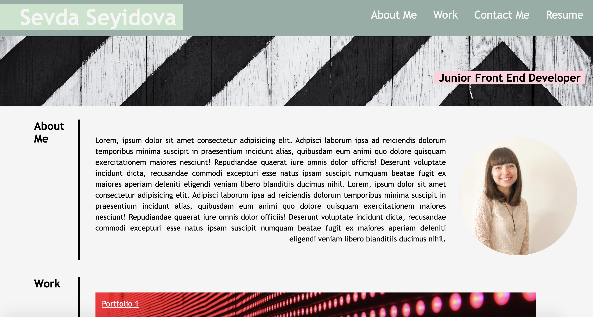
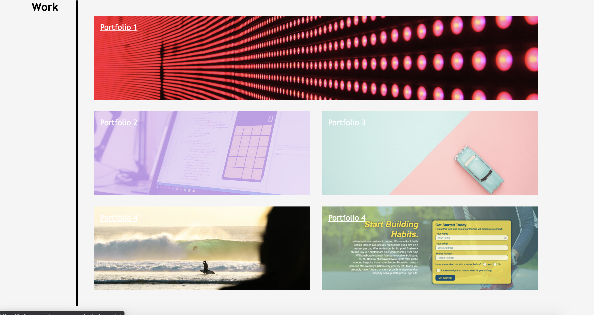
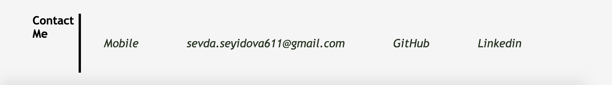

# challenge2-personalportfolio
 This portfolio page built by applying the core skills which was recently learned: flexbox, media queries, and CSS variables.

## Links

https://helloseva.github.io/challenge2-personalportfolio/

## Description 

This personal portfolio page of mine was built as a requirenment of the bootcamp, Module 2. This is work in progress and some section will be added as the course progresses. The website has a header with links to sections about me, my work, and how to contact me. When the page is loaded the page presents my name, my recent photo and about me. Then my works section is presented which was built using Grid layout. When each of the project image clicked, then the user is taken to that deployed application. Since I have not yet done any projects the links are temporarily added. When the page is resized or viewed on various screens and devices then the layout is responsive and adapts to my viewport.

## Table of Contents (Optional)

* [Installation]
* [Usage]
* [License]

## Installation

1. Go To https://github.com/helloseva/challenge2-personalportfolio
2. Copy the Git clone link using SSH.
3. In terminal on your local device, clone the repository using Git clone.
4. Open in Visual Studio.

## Usage 

This page is about me and my works. It can be used to to have a look on my recent Resume and contact details on how to reach me.

Screeshot of the Web Page:

## Credits

N/A

## License

Please refer to the LICENSE in the repo.

